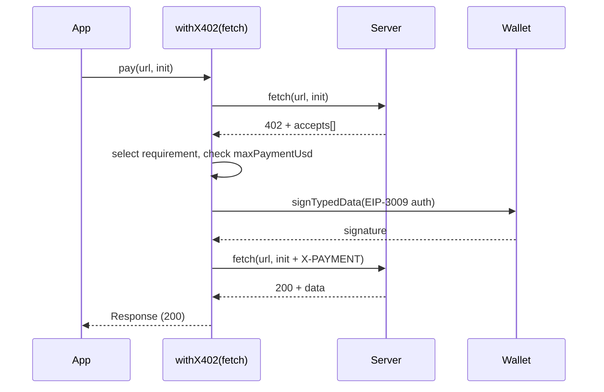

# @three-ws/x402-fetch

**A drop-in `fetch` that silently pays [x402](https://x402.org) payment challenges.** Wrap a wallet once, then call any paid x402 endpoint as if it were free — on a `402 Payment Required` the wrapper parses the challenge, signs a USDC-on-Base EIP-3009 authorization, and retries with the proof, all before your `await` resolves.

[](https://www.npmjs.com/package/@three-ws/x402-fetch)
[](./LICENSE)
[](https://nodejs.org)
[](./package.json)

---

## What it is

The [x402 protocol](https://x402.org) lets an HTTP server respond `402 Payment Required` with a machine-readable challenge instead of an API key. `@three-ws/x402-fetch` is the client half: it is a function with the exact same signature as `fetch`, but when it receives a 402 it pays the challenge with USDC on Base and transparently retries. Your application code never sees the 402 — it just gets the `200` and the data.

It is built for autonomous agents, scripts, and apps that need to pay per request without a checkout flow, an SDK login, or a stored API key.

- **Zero production dependencies.** The secp256k1 / keccak256 / EIP-712 signing stack is inlined — no `viem`, `ethers`, or `@wagmi/core` pulled into your bundle.
- **Drop-in `fetch` signature.** `withX402(wallet)` returns something you can use anywhere `fetch` works. Non-402 responses pass through untouched.
- **Works in the browser and Node.** MetaMask / any EIP-1193 provider, a viem account, or a raw private key — all accepted.
- **Safe by default.** A `maxPaymentUsd` guard refuses to auto-pay more than you authorize, so a misconfigured or hostile server can never silently overcharge you.
- **Standards-correct signatures.** Signs EIP-3009 `transferWithAuthorization` typed data — byte-for-byte what MetaMask's `eth_signTypedData_v4` and viem's `signTypedData` emit, so the facilitator's `ecrecover` lands on your address.
- **Upstream-compatible.** Ships a `wrapFetchWithPayment(fetch, wallet, options)` alias matching the upstream `x402-fetch` package, so it drops into existing x402 code.
- **Descriptive failures.** Every error path throws a single, actionable `Error` (over-limit, unsupported network, user-rejected, still-gated) instead of failing silently.

## Install

```bash
npm install @three-ws/x402-fetch
```

Requires **Node.js ≥ 18** (for global `fetch` and Web Crypto) or any modern browser. No native modules, no post-install scripts.

## Quickstart

From zero to a paid request in under a minute. In Node, with a funded Base wallet:

```js
import { withX402 } from '@three-ws/x402-fetch';
import { privateKeyToWallet } from '@three-ws/x402-fetch/wallet';

// 1. Wrap your wallet. This is the only setup step.
const pay = withX402(privateKeyToWallet(process.env.WALLET_PRIVATE_KEY), {
  maxPaymentUsd: 0.10, // never auto-pay more than 10¢ per request
});

// 2. Call a paid endpoint exactly like fetch. The 402 is handled for you.
const res = await pay('https://api.example.com/paid', {
  method: 'POST',
  headers: { 'content-type': 'application/json' },
  body: JSON.stringify({ prompt: 'hello' }),
});

// 3. Use the unlocked response.
console.log(await res.json());
```

In the browser, pass the injected provider instead:

```js
import { withX402 } from '@three-ws/x402-fetch';

const pay = withX402(window.ethereum, { maxPaymentUsd: 0.10 });
const res = await pay('https://api.example.com/paid');
```

That's the whole API surface for the common case. Everything below is reference detail.

## How it works

When you call the wrapped fetch, it issues your request normally. If the response is **not** a 402, it is returned untouched. If it **is** a 402:

1. The wrapper reads the challenge envelope — first from the base64 `PAYMENT-REQUIRED` response header (survives a consumed body and non-JSON content types), falling back to the JSON body.
2. It selects a payment requirement it can satisfy from `accepts[]` — an `exact`-scheme, EIP-3009 USDC requirement on an EVM network, preferring Base mainnet.
3. It checks the price against `maxPaymentUsd`. Over the limit, it throws and never signs.
4. It signs an EIP-3009 `transferWithAuthorization` over the wallet, base64-encodes the x402 v2 `PaymentPayload`, and **retries the original request** with that value in the `X-PAYMENT` header.
5. The retried (`200`) response is returned. If the server still answers 402, it throws.



## API reference

The full, exhaustive reference lives in [`docs/api.md`](./docs/api.md). The summary:

### `withX402(wallet, options?)` → `fetch`

The primary export (also the default export). Wraps a wallet into a fetch-compatible function that auto-pays x402 challenges.

```js
const pay = withX402(wallet, options);
```

It accepts three call conventions so both wallet-first and the upstream fetch-first shape work:

| Call | Meaning |
| --- | --- |
| `withX402(wallet, options?)` | Wallet-first (canonical). Uses the platform's global `fetch`. |
| `withX402(fetch, wallet)` | Fetch-first. Matches the upstream `wrapFetchWithPayment(fetch, wallet)` shape. |
| `withX402(fetch, { wallet, ...options })` | Fetch-first with options bundled alongside the wallet. |

**Parameters**

| Name | Type | Default | Description |
| --- | --- | --- | --- |
| `wallet` | `string \| EIP1193Provider \| { address, signTypedData }` | — | Required. The signer. See [Wallet guide](#wallet--signer-guide). |
| `options` | `X402Options` | `{}` | See [Configuration](#configuration-reference). |

**Returns** — a `typeof fetch` function: `(input, init?) => Promise<Response>`. Call it exactly like `fetch`.

**Throws** — synchronously if no `fetch` implementation is available (no global `fetch` and none passed) or if `wallet` is `null`/`undefined`. The returned function rejects on the payment errors documented under [Error handling](#error-handling).

### `wrapFetchWithPayment(fetch, wallet, options?)` → `fetch`

Upstream-compatible alias. Always fetch-first. Equivalent to `withX402(fetch, { wallet, ...options })`.

| Name | Type | Default | Description |
| --- | --- | --- | --- |
| `fetch` | `typeof fetch` | — | Required. The base fetch implementation to wrap. |
| `wallet` | `Wallet` | — | Required. See [Wallet guide](#wallet--signer-guide). |
| `options` | `X402Options` | `undefined` | See [Configuration](#configuration-reference). |

```js
import { wrapFetchWithPayment } from '@three-ws/x402-fetch';
const pay = wrapFetchWithPayment(fetch, wallet, { maxPaymentUsd: 0.25 });
```

### `privateKeyToWallet(pk)` → `{ address, signTypedData }`

Builds a Node signer from a raw private key using the inlined secp256k1 stack — no external wallet library. Available from the root export **and** the `@three-ws/x402-fetch/wallet` subpath (import the subpath if you only need the signer, e.g. in a worker).

| Name | Type | Default | Description |
| --- | --- | --- | --- |
| `pk` | `string \| Uint8Array` | — | 32-byte private key, as `0x`-hex or raw bytes. |

**Returns** `{ address: string, signTypedData(typedData) => Promise<string> }`. `address` is EIP-55 checksummed. `signTypedData` returns a `0x`-prefixed 65-byte (`r‖s‖v`) signature.

**Throws** — `x402: private key must be 32 bytes` or `x402: private key out of range` for an invalid key.

```js
import { privateKeyToWallet } from '@three-ws/x402-fetch/wallet';
const wallet = privateKeyToWallet('0x...');
console.log(wallet.address); // 0xAbC… (checksummed)
```

## Wallet / signer guide

`withX402` accepts three wallet shapes. Each is normalized internally to `{ getAddress(), signTypedData(typedData) }`.

### 1. Raw private key (Node)

A `0x`-hex string (or `Uint8Array`). Signed locally with the inlined secp256k1 — nothing leaves the process. Best for servers, agents, and CI.

```js
import { withX402 } from '@three-ws/x402-fetch';
import { privateKeyToWallet } from '@three-ws/x402-fetch/wallet';

const pay = withX402(privateKeyToWallet(process.env.WALLET_PRIVATE_KEY));
```

> You can also pass the raw key string straight to `withX402(process.env.WALLET_PRIVATE_KEY)`; it is converted to a signer for you. Wrapping it with `privateKeyToWallet` first lets you read `.address` up front.

### 2. EIP-1193 provider (browser)

Any object with a `request()` method — `window.ethereum`, MetaMask, Coinbase Wallet, WalletConnect, etc. The wrapper calls `eth_requestAccounts` to resolve the address and `eth_signTypedData_v4` to sign; the user approves the signature in their wallet.

```js
import { withX402 } from '@three-ws/x402-fetch';

const pay = withX402(window.ethereum);
```

### 3. Custom signer object (viem account / any SDK)

Any object exposing `address` (or `account.address`) and a `signTypedData(typedData)` method that returns a hex signature. A viem `LocalAccount` satisfies this directly.

```js
import { withX402 } from '@three-ws/x402-fetch';
import { privateKeyToAccount } from 'viem/accounts';

const account = privateKeyToAccount(process.env.WALLET_PRIVATE_KEY);
const pay = withX402(account);
```

Or hand-roll the shape against any KMS / HSM / remote signer:

```js
const signer = {
  address: '0xYourAddress',
  async signTypedData(typedData) {
    // typedData is { domain, types, primaryType, message } — sign it however you like
    return await myRemoteSigner.signEip712(typedData);
  },
};
const pay = withX402(signer);
```

> The `typedData` passed to a custom signer is the standard `eth_signTypedData_v4` object: `{ domain, types: { EIP712Domain, TransferWithAuthorization }, primaryType: 'TransferWithAuthorization', message }`.

## Configuration reference

Options for `withX402(wallet, options)` / `wrapFetchWithPayment(fetch, wallet, options)`:

| Option | Type | Default | Description |
| --- | --- | --- | --- |
| `maxPaymentUsd` | `number` | `0.10` | Hard ceiling per request, in USD. A challenge above this throws before any signature is produced. |
| `onPayment` | `(info) => void` | — | Called immediately before signing each payment. Receives `{ amount: number (USD), to: string (payTo), requestUrl: string }`. Use it to log or audit spend. |
| `timeout` | `number` | `15000` | Milliseconds to wait for the signature step before aborting with a timeout error. Set `0` to disable. |
| `network` | `string` | — | Preferred CAIP-2 network id from `accepts[]` (e.g. `"eip155:8453"`). Also accepted as `preferNetwork`. When the server offers multiple payable requirements, this one wins if present; otherwise Base mainnet is preferred. |

There are **no environment variables read by the library itself.** `WALLET_PRIVATE_KEY` in the examples is your own convention — you read it and pass the value in. Nothing is read from `process.env` implicitly.

## Supported networks & assets

This wrapper signs locally for **USDC** via **EIP-3009 `transferWithAuthorization`** on **EVM** networks, and prefers **Base mainnet**.

| Network | CAIP-2 id | Chain id |
| --- | --- | --- |
| **Base** (preferred) | `eip155:8453` | 8453 |
| Base Sepolia (testnet) | `eip155:84532` | 84532 |
| Arbitrum One | `eip155:42161` | 42161 |
| Ethereum mainnet | `eip155:1` | 1 |
| Optimism | `eip155:10` | 10 |

Base USDC asset address: `0x833589fcd6edb6e08f4c7c32d4f71b54bda02913`.

From the server's `accepts[]`, the wrapper selects an `exact`-scheme requirement whose `extra.assetTransferMethod` is `eip3009` (or unset). **Permit2** (`extra.assetTransferMethod === 'permit2'`), Solana, and other non-EIP-3009 schemes are skipped — if `accepts[]` contains *only* those, the request throws (see below). Auth-hint placeholders (`amount: "0"` or `extra.authRequired`) are never treated as payable.

## Error handling

The library throws plain `Error` objects with a stable `x402:` message prefix. Catch them around the wrapped fetch call and branch on `err.message`.

| Message contains | When | What to do |
| --- | --- | --- |
| `no supported network/asset was found in accepts[]` | The server's `accepts[]` had no EIP-3009 USDC (EVM) requirement. | The endpoint wants a network/asset this wrapper can't sign (e.g. Solana, Permit2). Use a compatible facilitator. |
| `exceeds maxPaymentUsd limit` | The challenge price is above your `maxPaymentUsd`. | Raise `maxPaymentUsd` if the price is acceptable. Nothing was signed. |
| `user rejected payment` | An EIP-1193 user cancelled the signature prompt (code 4001 / "user denied"). | Expected when the user declines. Surface a retry affordance. |
| `payment submitted but server still returned 402` | The retry was still gated. | Usually an amount/recipient mismatch or an expired authorization; verify the facilitator and offer. |
| `payment authorization timed out after Nms` | Signing exceeded `timeout`. | Raise `timeout`, or check the signer/provider. |
| `server returned 402 but no parseable payment challenge` | A 402 with no readable envelope. | The server isn't emitting a valid x402 challenge. |
| `a wallet is required` / `wallet object must expose an 'address'` | Misconfigured wallet argument. | Pass a valid wallet (see the [Wallet guide](#wallet--signer-guide)). |
| `private key must be 32 bytes` / `private key out of range` | Bad key passed to `privateKeyToWallet`. | Fix the key. |

```js
try {
  const res = await pay('https://api.example.com/paid');
  const data = await res.json();
} catch (err) {
  if (err.message.includes('exceeds maxPaymentUsd')) {
    console.error('Too expensive — declined automatically.');
  } else if (err.message.includes('user rejected payment')) {
    console.error('User cancelled the signature.');
  } else if (err.message.includes('no supported network/asset')) {
    console.error('Endpoint wants an unsupported chain/asset.');
  } else {
    throw err; // re-throw anything unexpected
  }
}
```

All thrown messages begin with `x402:`. There are no custom error classes — branch on `err.message`.

## Security notes

- **Your private key never leaves the process.** `privateKeyToWallet` signs locally with the inlined secp256k1; nothing is sent over the network except the resulting signature and authorization inside the `X-PAYMENT` header.
- **Always set `maxPaymentUsd`.** It defaults to `$0.10`, but set it explicitly to the most you'd ever pay for a single call. It is a hard pre-signature gate — an over-limit challenge throws and signs nothing, so a hostile or buggy server cannot drain the wallet one request at a time.
- **EIP-3009 authorizations are scoped.** Each signature authorizes exactly the `value`, recipient (`payTo`), and a `validBefore` window (the challenge's `maxTimeoutSeconds`, default 600s) with a fresh random `nonce` — it is not an open-ended approval.
- **Keep keys out of source.** Pass keys via environment variables or a secrets manager. Never commit them. For browsers, prefer an EIP-1193 provider so the user holds the key, not your page.
- **Audit with `onPayment`.** Log every `{ amount, to, requestUrl }` to a durable sink so spend is reviewable.
- **Fund a hot wallet, not your treasury.** Use a dedicated low-balance wallet for agent spending.

## FAQ / troubleshooting

**Does this support Solana / SOL / SPL tokens?**
No. It signs EVM EIP-3009 USDC only (Base preferred). A Solana-only `accepts[]` throws `no supported network/asset was found in accepts[]`.

**The endpoint is paid but I get `no parseable payment challenge`.**
The server returned a 402 without a valid x402 envelope (neither a `PAYMENT-REQUIRED` header nor a JSON body with `accepts[]`). It isn't x402-compliant, or it's returning HTML. Confirm the endpoint speaks x402 v2.

**My payment is signed but the server still 402s.**
You'll get `payment submitted but server still returned 402`. The signature is valid but the facilitator rejected it — typically because the on-chain `value`/`payTo` didn't match the offer, the authorization expired, or the wallet balance was insufficient. Verify the wallet is funded with USDC on the target chain and the facilitator is healthy.

**Do I need viem or ethers?**
No. The package has zero runtime dependencies — secp256k1, keccak256, and EIP-712 are inlined. You *can* pass a viem account if you already use one (see the [Wallet guide](#wallet--signer-guide)).

**Does it work with `Request` objects, not just URL strings?**
Yes. `withX402(...)` mirrors `fetch`, so the first argument can be a URL string or a `Request`. Headers from the original request are preserved on the retry; `X-PAYMENT` is added.

**Can I use it in a Cloudflare Worker / edge runtime?**
Yes, as long as the runtime has global `fetch` and Web Crypto (`crypto.subtle`) — both are present in Workers and Node ≥18. For private-key signing the runtime must expose `crypto.subtle` (used for the RFC-6979 HMAC).

**How do I cap total spend across many calls, not just per call?**
`maxPaymentUsd` is per request. For a running total, track it in `onPayment` and throw from your own code once a budget is exceeded.

**Why does the price look tiny (e.g. 50000)?**
The challenge `amount` is atomic units. With USDC's 6 decimals, `50000` = `$0.05`. The library converts it for you in `onPayment.amount` and the `maxPaymentUsd` check.

## Related packages

- **[`@three-ws/x402-server`](https://www.npmjs.com/package/@three-ws/x402-server)** — the server half: gate any endpoint behind an x402 challenge and verify payments.
- **[`@three-ws/x402-mcp`](https://www.npmjs.com/package/@three-ws/x402-mcp)** — pay-per-call x402 for MCP (Model Context Protocol) tools.
- **[`@three-ws/x402-payment-modal`](https://www.npmjs.com/package/@three-ws/x402-payment-modal)** — a browser UI modal for x402 payment approval.
- **[x402 protocol spec](https://x402.org)** — the open standard this package implements.

## Documentation

- [`docs/api.md`](./docs/api.md) — exhaustive API reference (every export, every option, every error).
- [`docs/examples.md`](./docs/examples.md) — runnable examples: Node script, agent loop, viem integration, error handling.
- [`CONTRIBUTING.md`](./CONTRIBUTING.md) — local dev, build, and test workflow.

## License

Proprietary — Copyright (c) 2026 nirholas. All Rights Reserved. Unauthorized use, copying, modification, or distribution is prohibited. See [LICENSE](./LICENSE).
